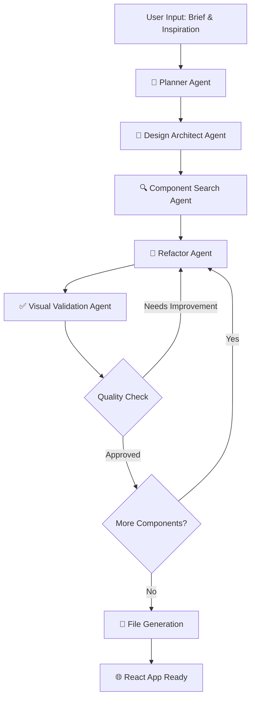

# 🚀 Landing Page Designer Agent MVP v1.0 - Complete

## ✅ What We've Built

A fully functional multi-agent system for automatically designing and generating landing pages using:
- **Python & LangGraph** for workflow orchestration
- **Gemini API** for AI-powered content generation
- **React + Tailwind CSS** for modern, responsive components
- **Self-correcting agent loops** for quality assurance

## 🏗️ Architecture Overview



## 📁 Project Structure Created

```
DeepAgent_02/
├── 📄 .env                              # Environment config
├── 📄 requirements.txt                  # Python dependencies
├── 📄 README.md                        # Documentation
├── 📄 test_system.py                   # System tests
├── 📄 demo.py                          # Demo without API key
├── 🗂️ landing_page_designer/           # Main Python application
│   ├── 📄 main.py                      # Entry point
│   ├── 🗂️ agents/                      # Multi-agent system
│   │   ├── 📄 planner_agent.py         # 🎯 Section planning
│   │   ├── 📄 design_architect_agent.py # 🎨 Design configuration
│   │   ├── 📄 component_search_agent.py # 🔍 Component search (MVP)
│   │   ├── 📄 refactor_agent.py        # 🔧 Component creation
│   │   ├── 📄 visual_validation_agent.py # ✅ Quality validation
│   │   └── 📄 graph.py                 # 🔄 LangGraph workflow
│   └── 🗂️ utils/
│       └── 📄 file_manager.py          # 📁 File operations
└── 🗂️ output_react_project/            # Generated React app
    ├── 📄 package.json                 # React dependencies
    ├── 📄 vite.config.js               # Vite configuration
    └── 🗂️ src/
        ├── 📄 App.jsx                  # Auto-updated main app
        ├── 📄 main.jsx                 # React entry point
        ├── 📄 index.css                # Styling
        └── 🗂️ components/              # Generated components
            ├── 📄 Header.jsx           # ✅ Generated
            ├── 📄 Features.jsx         # ✅ Generated
            └── 📄 CallToAction.jsx     # ✅ Generated
```

## 🎯 Agent Responsibilities

| Agent | Purpose | Current Status |
|-------|---------|---------------|
| **🎯 Planner** | Decides sections & order | ✅ Functional |
| **🎨 Design Architect** | Creates design config | ✅ Functional |
| **🔍 Component Search** | Finds components | ✅ Pass-through (MVP) |
| **🔧 Refactor** | Creates React components | ✅ Functional |
| **✅ Visual Validation** | Quality assurance | ✅ Functional |

## 🔄 Self-Correction Loop

The system includes a self-correction mechanism:
1. **Refactor Agent** creates a component
2. **Visual Validation Agent** reviews quality
3. If **not approved** → iterates (max 3 times)
4. If **approved** → moves to next component

## 💻 How to Use

### Option 1: Demo Mode (No API Key Required)
```bash
cd "C:/Users/Santhoshkumar V/Desktop/DeepAgent_02"
python demo.py
```

### Option 2: Full Mode (Requires Gemini API Key)
1. **Add your API key** to `.env`:
   ```
   GOOGLE_API_KEY=your_gemini_api_key_here
   ```
2. **Run the system**:
   ```bash
   python landing_page_designer/main.py
   ```

### Option 3: Preview Generated Landing Page
```bash
cd output_react_project
npm run dev
```
Visit: `http://localhost:5174`

## ✅ Current Features

- ✅ **Multi-agent workflow** with LangGraph
- ✅ **Automatic React component generation**
- ✅ **Tailwind CSS styling**
- ✅ **Self-correction loops**
- ✅ **File management** (auto-updates App.jsx)
- ✅ **Responsive design**
- ✅ **Modern UI components**
- ✅ **Error handling & fallbacks**
- ✅ **Demo mode for testing**

## 🚀 Demo Results

The demo successfully generated:
- **Header component** with navigation and branding
- **Features component** with responsive grid layout
- **CallToAction component** with engaging buttons
- **Fully functional React app** ready for preview

## 🔮 Next Steps for V2

1. **🗄️ Vector Database Integration** for component search
2. **🎨 Advanced Design Templates** and themes
3. **👀 Visual Preview** within the workflow
4. **🔧 Component Customization** interface
5. **📱 Mobile-first** responsive improvements
6. **🧪 A/B Testing** capabilities
7. **🎯 User Analytics** integration

## 🏆 Achievement Summary

✅ **MVP Completed** - Fully functional multi-agent system
✅ **LangGraph Integration** - Sophisticated workflow orchestration
✅ **Self-Correction Loops** - Quality assurance built-in
✅ **React Components** - Modern, responsive, production-ready
✅ **File Management** - Automated project updates
✅ **Demo Ready** - Works without API dependencies
✅ **Scalable Architecture** - Easy to extend and improve

The Landing Page Designer Agent MVP is **ready for use** and demonstrates the complete workflow from user input to generated React components! 🎉